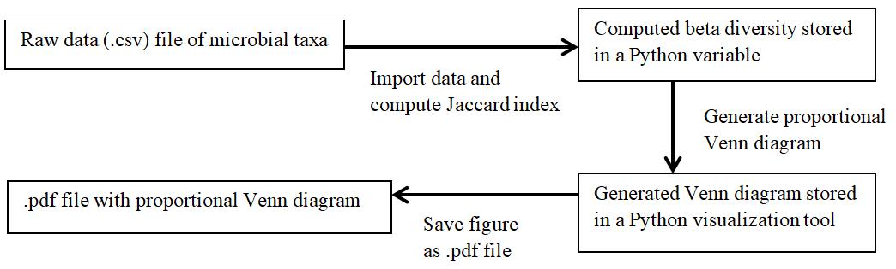

# Comparing composition similarity between microbial communities  
**Name:** Libby Wilson  
**Semester:** Spring 2019  
**Project area:** Microbial ecology  

**Objective:** The goal of this project is to create a Python script that will compare composition between two microbial communities (using Jaccard similarity). I then aim to visually represent this similarity in a proportional Venn diagram figure.  

**Outcomes:** I want the script to output a Jaccard index value (a number value to quantify beta diversity of the two microbial communities), and I also want it to create a visual representation of the overlap in similarity. This figure will look like a proportional Venn diagram (see Figure 1 below for a conceptual drawing of how it might appear).  

  

**Background and Rationale:** Comparing microbial community composition is important for identifying factors that shape microbiomes. Changes or differences in microbial community composition are referred to as beta diversity.1 When I analyze my upcoming field work, I will need to compare microbial community composition between fish of the same species that are living in different environments (streams rich in hydrogen sulfide vs. nonsulfidic streams) in order to understand whether their microbial communities are shaped more by environmental or phylogenetic factors. Calculating beta diversity will therefore be a first step toward disentangling these factors.
	Beta diversity values are time-consuming to calculate, especially as multiple community pairs are added to my dataset. Furthermore, the meaning of beta diversity values is most clearly conveyed through a visual representation, which is why I would like to use a Python script to calculate Jaccard similarity and generate a proportional Venn diagram.  

**Sketch:**   
  

The raw data shown in Step 1 of the sketch above will be acquired from two fish gut microbial communities (one before and one after starvation).2 These data will be formatted in a spreadsheet in which each community will have a list of Operational Taxonomic Units (OTUs/species) that are present. These taxonomic groups will be used in the calculation of the Jaccard index. 

**References:**  
1.	Kumar, R., Eipers, P., Little, RB., et al., 2014. Getting started with microbiome analysis: sample acquisition to bioinformatics. Current protocols in human genetics, 82(18), pp. 1-29.  
2.	Xia, J.H., Lin, G., Fu, G.H., et al., 2014. The intestinal microbiome of fish under starvation. BMC genomics, 15(1), pp. 266.
